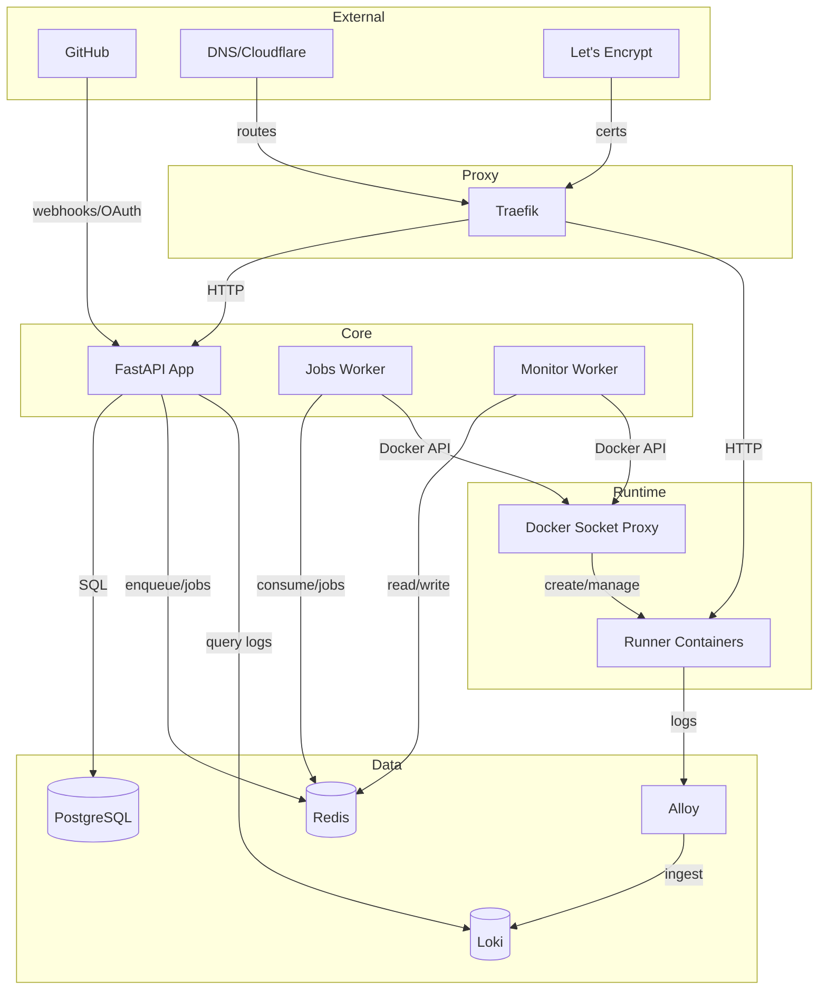
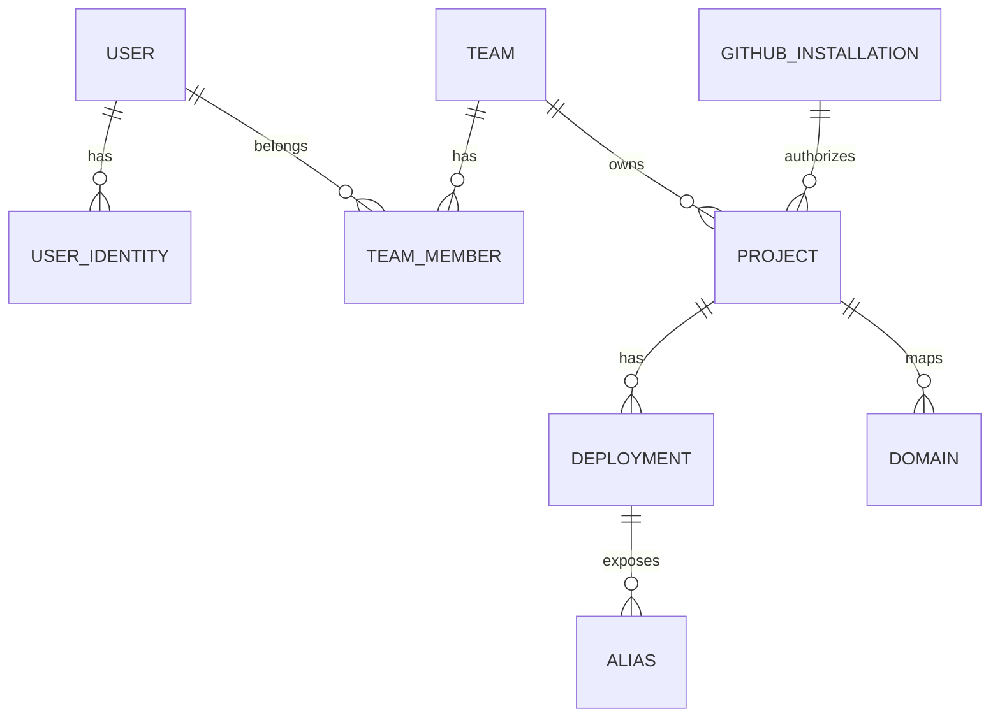

# Architecture

This document describes the high‑level architecture of /dev/push, how the main services interact, and the end‑to‑end deployment flow. It reflects the current implementation in this repo.

## Stack

- Docker & [Docker Compose](https://github.com/docker/compose)
- [Traefik](https://github.com/traefik/traefik)
- [Loki](https://github.com/grafana/loki)
- [Alloy](https://github.com/grafana/alloy)
- [PostgreSQL](https://www.postgresql.org/)
- [Redis](https://redis.io/)
- [FastAPI](https://fastapi.tiangolo.com/)
- [arq](https://arq-docs.helpmanual.io/)
- [HTMX](https://htmx.org)
- [Alpine.js](https://alpinejs.dev/)
- [Basecoat](https://basecoatui.com)

## Overview

- **App**: The app handles all of the user-facing logic (managing teams/projects, authenticating, searching logs...). It communicates with the workers via Redis.
- **Workers**: When we create a new deployment, we queue a deploy job using arq (`app/workers/jobs.py`). It will start a container, then delegate monitoring to a separate background worker (`app/workers/monitor.py`), before wrapping things back with yet another job. These workers are also used to run certain batch jobs (e.g. deleting a team, cleaning up inactive deployments and their containers). Deployment lifecycle statuses: `prepare → deploy → finalize → completed` (with `conclusion`: succeeded/failed/canceled/skipped; `fail` is transient for failure handling).
- **Logs**: build and runtime logs are streamed from Loki and served to the user via an SSE endpoint in the app.
- **Runners**: User apps run inside runner containers pulled from the registry catalog (e.g. `ghcr.io/devpushhq/runner-python-3.12:1.0.0`). The deploy job (`app/workers/tasks/deployment.py`) creates the container and runs the configured build/start commands.
- **Reverse proxy**: We have Traefik sitting in front of both app and the deployed runner containers. All routing is done using Traefik labels, and we also maintain environment and branch aliases (e.g. `my-project-env-staging.devpush.app`) using Traefik config files.

## File structure

- `app/`: The main FastAPI application (see README file).
- `app/workers`: The workers (`jobs` and `monitor`)
- `docker/`: Container definitions and entrypoint scripts for the app/workers and local development.
- `scripts/`: Helper scripts for local (macOS) and production environments
- `compose/`: Container orchestration with Docker Compose. Files: `base.yml`, `override.yml`, `override.dev.yml`, and SSL provider-specific files (`ssl-default.yml`, `ssl-cloudflare.yml`, etc.).

Operational script notes:
- `start.sh`, `stop.sh`, and `restart.sh` support component-scoped operations via `--components <csv>`.
- `update.sh` defaults to updating `app` only; use `--all`, `--components`, `--full`, or `scripts/upgrades/*.json` metadata to widen update scope.

## System Diagram

Notes:

- Runner containers write logs locally; Alloy tails those files and ships them to Loki. The app queries Loki to stream build/runtime logs to clients (SSE).
- Traefik routes both the app and user deployments. Dynamic file configuration is generated for aliases and custom domains.

## Components

### App (FastAPI)

- Web app and webhook API, allowing users to login and manage teams/projects/deployments.
- Processes GitHub webhooks; creates deployments; serves SSE for project updates and deployment logs.
- Files: `app/main.py`, `app/routers/*`, `app/services/*`, `app/models.py`.

### Workers

#### Jobs

- Background jobs for deployments and cleanup.
- Jobs: `start_deployment`, `finalize_deployment`, `fail_deployment`, `delete_container`, `delete_*`.
- Files: `app/workers/jobs.py`, `app/workers/tasks/deployment.py`, `app/workers/tasks/project.py`, `app/workers/tasks/team.py`, `app/workers/tasks/user.py`.

#### Monitor

- Polls running deployments every ~2s, probes port 8000 over `devpush_runner` network.
- On success enqueues `finalize_deployment`; on failure enqueues `fail_deployment`; cancellations enqueue `delete_container` to clean up runners after a grace.
- File: `app/workers/monitor.py`.

### Traefik

- Reverse proxy with Docker and file providers; TLS via ACME.
- Routes: app (`APP_HOSTNAME`) and deployments (by Docker labels and dynamic file for aliases/domains).
- Catch-all router: `deployment-not-found` redirects unknown deployment subdomains to a "deployment not found" page.
- Certificate challenge provider selection: Determines which `ssl-*.yml` compose file is loaded; configured via `CERT_CHALLENGE_PROVIDER` in `.env`.

### Docker Socket Proxy

- `tecnativa/docker-socket-proxy` exposing a limited Docker API used by workers and Traefik.

### PostgreSQL

- Primary datastore (users, teams, projects, deployments, aliases, domains, GitHub installations).

### Redis

- ARQ job queue and Redis Streams for real‑time updates to the UI.

### Loki

- Centralized logs for deployments (build/runtime). Queried by the app for streaming.

## Deployment Flow

1) Trigger
  - Webhook: GitHub -> `/api/github/webhook` (verify, resolve project) -> create DB record -> enqueue `start_deployment`.
  - Manual: user selects commit/env -> create DB record -> enqueue `start_deployment`.

2) `start_deployment`
  - Create runner container (language image, env vars, resource limits, Traefik labels; Alloy tails container logs).
  - Inside container: clone repo at commit, run optional build/pre‑deploy commands, then start app.
  - Mark deployment `in_progress`, set `container_id=…`, emit Redis Stream update.

3) Monitor
  - Probe container IP on `devpush_runner:8000/`.
  - On ready -> enqueue `finalize_deployment`. On exit/error -> enqueue `fail_deployment`.

4) Finalize:
  a) finalize_deployment (success)
    - Mark `status=completed`, `conclusion=succeeded`.
    - Create/update aliases: branch, environment, environment_id.
    - Regenerate Traefik dynamic config for aliases and custom domains.
    - Enqueue `cleanup_inactive_containers` and emit Redis Stream updates.

  b) fail_deployment (error)
    - Stop/remove container if present; mark `conclusion=failed` and emit updates.

## Data Model (Simplified)

Notes:

- Project env vars and OAuth tokens are encrypted at rest (Fernet).
- Deployment captures a snapshot of project config/env at creation time.
- Aliases track current and previous deployment to support instant rollback.

## Networking

- `devpush_default`: public (Traefik, app, Loki).
- `devpush_internal`: internal (DB, Redis, Docker proxy, Traefik file provider).
- `devpush_runner`: runner network for deployed containers; Traefik and workers attach to route/probe.

## Observability

- Logs: runner containers -> Loki; app queries `Loki /loki/api/v1/query_range` and streams via SSE.
- Status: Redis Streams power SSE for project and deployment updates.
- Health: app `/health`; ARQ `--check`; Docker Compose healthchecks for services.

## Security

- Sessions: signed cookies with CSRF protection (no Redis session storage).
- Secrets: Fernet encryption for env vars and tokens.
- Docker: access via socket proxy with limited capabilities; runner containers run as non‑root with resource limits.

## Scaling

- App and workers can scale horizontally behind Traefik.
- DB and Redis can be sized independently; cleanup tasks keep unused containers down.

## Implementation Notes

- Traefik dynamic config for aliases/domains is written to `TRAEFIK_DIR` per project (`DeploymentService.update_traefik_config`).
- Runner images are language‑specific (e.g., Python, Node). Selection and commands come from project config.
- SSE endpoints: `app/routers/event.py` for project updates and deployment logs.
