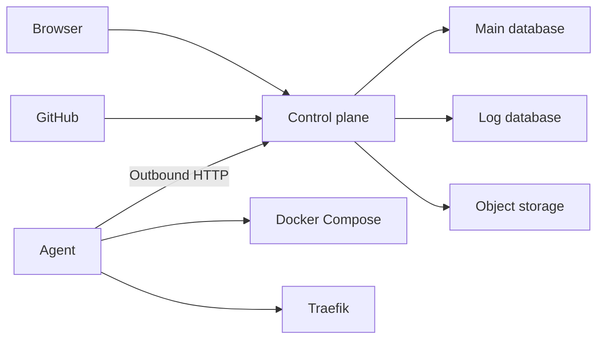

# Architecture

devpush has two execution boundaries: a TanStack Start control plane and a Go
agent on each deployment server. The control plane never runs Docker. Agents own
Compose execution, Traefik ingress, host observations and local recovery state.

```mermaid
flowchart LR
  Browser --> App[Control plane]
  GitHub --> App
  Agent -->|Outbound HTTP| App
  App --> Main[Main database]
  App --> Logs[Log database]
  App --> Storage[Object storage]
  Agent --> Docker[Docker Compose]
  Agent --> Traefik
```

## Code ownership

`app/src/routes` defines loaders, guards, search contracts and route states.
Product UI and state live in `features/<domain>`. Generic shadcn primitives live
in `components/ui`; shared components need actual reuse. Runtime-independent
schemas and client helpers belong in `lib`, and authorization, persistence and
provider integrations in `server`. Agent code is separate under `agent/`.

Shared server services work on Node and Cloudflare. Vite aliases select database,
object-storage, version-reader, platform environment, MCP OAuth discovery,
workspace notifications and generated plugin registries.
Workers never fall back to local files. Agent HTTP routes validate requests and
delegate to typed services; browser, API and MCP handlers reuse domain logic.

See [Configuration](docs/configuration.md), [API](docs/api.md) and
[Agent protocol](docs/agent-protocol.md) for supported external contracts.

## Storage and atomic writes

| Store | Ownership |
| --- | --- |
| Main SQLite, D1 or libSQL database | Accounts, teams, projects, environments, servers, deployments, control events, jobs, observations, backup metadata, credentials, API audit and idempotency. |
| Separate log database | Deployment output, runtime output, operation diagnostics and log-cleanup cursors. |
| Local or S3-compatible object storage | Uploaded avatars. Optional on Workers; Node defaults to local disk. |
| Deployment host | Runtime volumes, local backup archives and durable upload outboxes. |

There are no cross-database foreign keys. Log ingestion validates identity in the
main database before writing output. Every read rechecks current authorization.
Output writes are bounded and idempotent; an acknowledged upload is persisted or
deduplicated. Main-database queue and cancellation events commit with their state
changes; reads merge these with agent output from log storage.

All backends use guarded SQL statements and atomic batches. D1 does not support
application callback transactions. Admission predicates check live permissions
and resource state inside the final write, rather than relying only on an earlier
read. Builds and remote requests never hold database transactions open.

Node uses native SQLite or remote libSQL. Workers use D1 or a request-scoped
libSQL web client, closed after each statement or batch. The libSQL adapter keeps
positional result mapping so joined columns with duplicate names remain distinct.
Main and log stores have independent connection configuration.

Project runtime configuration is one type-discriminated JSON object. Compose is
the only supported runtime. Environments, aliases and domains have stable
relational identities. Backup policies remain separate because scheduling and
retention query them across projects; editing one policy updates one row and
preserves its creation timestamp. Runs represent executions; artifacts represent
independently retained local or remote files.

## Authorization and credentials

Installation administration is independent of team roles. `DEVPUSH_ADMIN_EMAIL`
selects the administrator; the earliest-created user is the fallback. Team
members may use projects and ordinary project settings. Owners and admins manage
servers, storage and privileged deploy/rollback host commands. Services enforce
these rules independently of UI visibility.

Membership changes check the actor, target role and remaining active ownership
inside the mutation. Ownership transfer promotes and demotes in one guarded
statement. Bootstrap creates a team and its owner together. Invitation acceptance
checks the pending token, verified email, expiry and active account/team in the
batch adding membership. Concurrent demotions cannot remove every active owner.

Project environment variables and backup-storage secrets are encrypted with
AES-GCM. Backup credentials live only in the current workspace storage record;
queued jobs and run history contain storage IDs and immutable locations. The
control plane decrypts current credentials only for a compatible authenticated
claim. Missing or foreign storage fails the job; historical ciphertext is not a
fallback.

Linked provider account tokens use reversible encryption as described below.
Protect databases, exports and encryption keys as secrets. API keys, OAuth access and
refresh tokens, authorization codes and agent credentials use hashed storage;
OAuth confidential-client secrets follow the provider's encryption policy.
Public origins require strong, distinct authentication and encryption secrets.

Avatar replacement uploads a unique object before committing its reference.
Only a successful save permits removal of the previous owned object; a rejected
save removes its newly staged object. Cleanup validates resource ownership and
does not trust arbitrary stored image URLs.

## Provider-token storage

Better Auth encrypts linked provider access and refresh tokens using
`BETTER_AUTH_SECRET`; account hooks encrypt ID tokens using the same codec.
GitHub account reads and Google identity parsing decrypt stored values before use.
Maintenance rewrites up to 100 existing plaintext account records per invocation.
Each rewrite compares the original access, refresh and ID tokens together so a
concurrent provider refresh is preserved. This uses the existing account columns
on SQLite, D1 and libSQL; no schema migration is required. Deploy all control-plane
instances together and retain the original authentication secret. API/MCP bearer
credentials use their existing hashed storage.

## Public sign-in notice

The public sign-in notice comes from `DEVPUSH_SIGN_IN_MESSAGE` in deployment
configuration. Login reads it without an installation-settings database query.
It has no Admin editor or concurrency counter; changing it requires a restart or
redeploy. Authentication policy remains separate, in the allowlist table.

## Settings consistency

Editable resources use an integer `settings_version`. A form captures its values
and version together. Save checks that version and current permissions, changes
only the intended fields, and increments the version in one write. Project
sections share one version; teams, accounts, servers, policies and storage have
independent versions. Dependencies are still validated at write time.

Clean forms adopt refreshed values and version together. Dirty forms retain their
original baseline, including when another section saves. Editors use immutable
resource IDs so navigation cannot reuse a different resource's draft.
Configuration-field triggers cover internal/provider changes; explicit settings
saves increment once, including no-op saves. Heartbeats, metrics, job progress,
sign-in activity and Compose metadata refreshes do not advance settings versions.
There is no monotonic `updated_at` trigger. Server heartbeats leave that lifecycle
timestamp alone; registration, credential promotion and connection-state changes
may update it. Unchanged GitHub push metadata does not touch the project row.

Stale saves return `SETTINGS_CONFLICT`. Browser forms preserve the draft and show
a persistent Sonner notification with Reload and Dismiss. Reload confirms before
discarding all page edits. Renamed projects/teams return a safe current URL.
REST/MCP return 409 with the same conflict code. There is no automatic retry,
merge or force overwrite. Expected action errors cross RPC as safe plain objects;
unexpected errors are logged server-side and replaced by a generic public code.
Field validation remains beside its input; save failures use Sonner.

## Deployment lifecycle

An environment has a stable runtime ID. Compose reconciles it in place using
`docker compose -p <runtimeId>`, preserving service identity and named volumes.
The effective server is the environment override or project default. Deployments
reach their project through their environment, rather than a second project ID.

Queue admission snapshots the repository ref, resolved runtime configuration,
expanded routes and encrypted environment variables. GitHub credentials are
resolved at claim time and never frozen in that snapshot. Enqueueing commits the
record, superseded-deployment cancellation, control events and generated aliases
in one batch. Duplicate GitHub delivery IDs skip every effect. Hostname collisions
roll back admission, and generated aliases cannot claim custom-domain names.

Claims select work inside a guarded update. A partial unique index permits one
running deployment per runtime. Claims and terminal writes recheck status; a
canceled or completed deployment cannot move aliases again. Completion persists
output before committing deployment state and successful environment/branch
alias changes. Timeout handling commits the failure event and terminal state
atomically, in bounded batches.

Redeploy and rollback create new deployment records using the selected commit,
runtime settings and environment-variable snapshot. Public routes are resolved
from current project routing, active domains and aliases, with a new deployment
hostname. They cannot restore a removed hostname. Historical replay rejects an
environment moved to another server; create a normal deployment there instead.
Queued job payloads are subsequently assembled from their deployment record.

The agent clones the exact revision using a short-lived installation token in
Git's child environment, not command arguments or persisted remote URLs. Compose
paths must remain inside the repository after symlink resolution. Checkout pruning
protects bind sources and Compose references of all containers, including stopped
ones; inventory failure prevents deletion.

The resolved Compose override removes published host ports and host networking,
keeps services on their runtime network, and attaches routed services to the
shared ingress network. A pinned Docker socket proxy on a separate internal
network serves Traefik. Application networks cannot reach that proxy.

Default deployment uses `compose up -d`; it is not a zero-downtime rollout.
Pre-deploy commands run in a selected Compose service. Custom deploy/rollback
commands run on the host with resolved variables and managed Compose paths.
They replace only the update operation; checkout, image preparation, reporting
and readiness checks remain managed. Commands using Compose must include the
managed override. See [Compose deployments](docs/compose-deployments.md).

All deployed repositories are trusted host code. Privileged services, bind mounts
and Docker access can reach host data. Role checks on host commands are not tenant
isolation, and project environment variables enter those commands' environment.
Use separate servers for mutually untrusted repositories.

## Agent jobs and recovery

Enrollment exchanges a one-hour token for a dedicated agent credential.
Registration and heartbeats prove possession of staged replacement credentials
before retiring old ones. Rotation uses compare-and-set guards and the host CLI
drains active work before restarting. Disable cuts authentication; deletion
permits only explicitly retained deployment/cleanup work.

The agent serializes claims, execution and completion delivery with a filesystem
lock. Before execution it persists a minimal failed-completion fallback containing
only job identities. The normal result atomically replaces it. After restart the
agent first resolves durable volume-restore journals, then the outbox reports interruption before claiming more work; it does not rerun a partial
restore or deployment automatically. A crash between the remote claim and local
persistence still relies on control-plane timeout recovery.

Completion and log outboxes survive restart. Credentials are attached at delivery,
not stored in pending files. Network errors and rejected acknowledgments retain
the report and block further claims. This deliberately avoids silently abandoning
results; [Agent maintenance](docs/agent-maintenance.md) covers recovery. Do not
turn a schema/identity failure into permission to discard a completion.

Deployments have deadline and lost-heartbeat recovery. Backup, restore and backup
cleanup jobs expire after 25 hours; queued jobs measure from availability, running
jobs from claim time. Periodic maintenance sweeps these globally in pages of 500,
so an offline agent cannot reserve an environment indefinitely. Per-agent polling
also sweeps its own jobs. Failure releases associated run/cleanup state with the
same claim and payload guards. Container cleanup uses separate bounded retries.

Backup execution creates a run and job together after checking current policy,
environment, storage and server. Schedule keys deduplicate each policy/UTC minute;
a partial unique index prevents simultaneous active backups in one environment.
Restore admission prevents another active restore for that environment.
Completion commits artifacts and run/job statuses together. Retention independently
selects generations for each tier with remaining artifacts, reserves cleanup and
releases failed reservations for a later retry. Remote archives preserve their
original location while credentials come from current storage configuration.
See [Backups](docs/backups.md) for contents, consistency and restore limits.

## Observations, logs and notifications

Runtime reconciliation decides ownership inside the cleanup batch. Active
environments, in-flight deployments and unfinished cleanup jobs protect a
runtime. Reassignment back to a server resets its observation cleanup timestamps;
a subsequent orphaning starts a new grace and seven-day volume-retention window.
Each cleanup job contains at most 200 runtimes.

Agents discover IPv4/IPv6 separately at startup and every 15 minutes, retaining
cached addresses after failed discovery. Installer `--address IP` persists a
routing pin and disables discovery; `--address auto` restores it. The pin takes
precedence over discovered addresses. Connection IP is monitoring metadata, not
routing configuration. Generated names embed the selected address; existing
hostnames are not universally rewritten after an IP change.

Metrics are saved locally before upload, retaining 24 hours and a checkpoint per
control-plane origin/server identity. Acknowledgments advance ordered batches;
replay uses original collection times. Collection gaps stay gaps. Server charts
fetch history separately from lightweight live status and downsample displayed
extrema without modifying stored samples. Monitoring retention defaults to seven
days; maintenance prunes bounded pages even for offline servers.

Runtime logs use per-runtime durable capture queues, content-hash deduplication
and acknowledged cursors. A full host queue pauses capture. Pending captures can
finish uploading after a runtime leaves the active list, using historical server
ownership, while reads still check current project permissions. Docker rotation
before capture can lose source output; captured output is retained until acknowledged.

Deployment output uses stable agent sequences and bounded replay chunks.
Backup/restore diagnostics use byte-cursor host files and central operation logs;
dump stdout is an artifact, never diagnostics. Operation logs retain 14 days,
with a 10 MiB per-job host limit and 100 MiB total budget. Maintenance removes
expired runtime output and orphan deployment output with durable scan positions.

Workspace notifications contain invalidation hints, not authoritative data.
Cloudflare uses one SQLite Durable Object per team with hibernating WebSockets;
Node uses a process-local broadcaster. Socket admission validates origin, session
and membership; broadcasts recheck active access and close revoked connections.
Notification failure cannot roll back an acknowledged mutation. Browsers batch
hints, reconnect with backoff and refetch authorized snapshots. Polling repairs
missed hints and handles unavailable sockets; hidden pages pause live refreshes.
A multi-process Node deployment needs shared pub/sub for immediate cross-process
notifications; recovery polling still works.

## Browser data ownership

TanStack Query owns cached section data and its 30-second freshness window.
Router loaders consult `fetchQuery` with no competing freshness window, reusing
fresh data and deduplicating requests. Intent preloading uses that same client.
These are in-memory caches, not persisted browser storage. Account/admin/auth and
invitation direct loaders do not all share that policy.

Loaders perform authorization and bounded reads. Normal page rendering does not
repair data, call GitHub or probe stored objects. Compose metadata is persisted
project state, refreshed during explicit workflows. API Compose-path changes
clear metadata from the old file. Mutations cancel older reads, invalidate affected
queries including inactive entries, then seed authoritative saved values.

Authenticated settings/team/invitation routes use client rendering; login keeps
SSR. Pending layouts preserve known identities, labels and disabled controls;
only unknown data becomes a skeleton. Cached empty lists immediately show real
empty states. Background errors retain visible data. Branch options fetch commits
only for the selected branch; logs fetch appended output with separate terminal
keys to prevent late running responses from hiding final output.

## External management access

`/api/v1` and `/mcp` share `server/api/operation-contract.ts` and the operation
executor. Explicit schemas validate inputs and safe DTOs; browser aggregate
contexts are never serialized as public resources. The catalog also generates
OpenAPI. Read projections, write dispatch and authorization context have separate
modules, rather than one catch-all handler.

API keys bind to a user, membership instance, team, optional project restrictions,
issued scopes/role ceiling and expiry. Every request checks current access;
credentials cannot revive after membership removal. Nullable expiry means no
scheduled expiration; finite durations are 1–365 days. OAuth grants always expire.
Write effects embed live authorization and commit API audit/idempotency records
atomically. The membership owns the shared operation rate budget. Accepted work
is not canceled by later revocation. These audit records are not a unified audit
trail for browser and background activity.

MCP uses the SDK's stateless fetch handler. Browser authorization uses the OAuth
provider for discovery, PKCE codes, opaque tokens, refresh rotation and reuse
revocation. The bridge additionally checks the active devpush grant and intersects
token scopes with it. API-key bearer authentication is supported separately.
Node supports DNS-pinned client metadata discovery; Workers use dynamic
registration without an unpinned-fetch fallback. Auth initializes lazily within
requests, rather than seeding resources during module import.

`DEVPUSH_MCP_URL` fixes the canonical resource/audience; the OAuth issuer uses
`BETTER_AUTH_URL`. This permits localhost MCP with a VM-reachable base URL.
Changing the resource URL requires reauthorization. API token/idempotency/audit
maintenance uses bounded pages; refresh reuse records survive until expiry.

## Deletion and retention

Deletion is a guarded soft-delete transition, not a full relational cascade.

| Resource | Immediate effects | Deferred or retained state |
| --- | --- | --- |
| Account | End sign-in, remove provider accounts, revoke keys/grants, queue cleanup. | Remove memberships, invitations and avatar; delete eligible sole-member teams; retain user/job records until final cleanup. |
| Project | Cancel affected work; keep hostname reservations until container removal. | Queue requested runtime cleanup and delayed purge; retained containers keep routes. |
| Team | Cancel work, mark resources deleted and revoke credentials. | Keep server/runtime references for cleanup. |
| Server | Cancel backup/restore work, release reservations, remove monitoring and mark deleted. | Preserve the chosen handling of ongoing deployments and permitted cleanup access. |

Settings owned by surviving teams/projects remain when a user leaves. Backup
policies, history and storage credentials do not cascade on soft deletion. Maintenance permanently removes eligible deleted resources in bounded batches
after a 30-day retention window. It deletes projects before servers and teams;
foreign-key cascades remove owned settings, backup metadata and credentials.
Pending/failed jobs, retained environments, recorded backup artifacts and unresolved
runtime observations block collection. Successful cleanup records remain for at
least 30 days so agents can retry lost acknowledgements. Project/team avatars are
removed before their owning rows; storage failures preserve the reference for retry.
Hostname reservations are released after successful deprovisioning, without
waiting for delayed volume purge or the metadata retention window. Intentionally
retained runtimes keep their reservations. External archives and failed cleanup
still require explicit resolution. Audit history survives resource deletion until
retention. Remaining lifecycle work is tracked only in [TODO](TODO.md).

Account cleanup fences attempts with claim time and attempt number; avatar cleanup
finishes before success. Container cleanup claims and completions carry the monotonic attempt number
under `jobs.compose.cleanup.v2`. A completion from an older attempt is acknowledged
without modifying the current attempt; SQL snapshot guards also fence concurrent
reclaims. Deleted servers can retry a retained cleanup completion even when idle. Retention ignores deleted resources and unsupported remote
snapshots, and failed cleanup waits an hour before automatic retry.

Operator deletion recovery builds guarded SQL batches in
`app/src/server/deletion-recovery.ts`. The CLI connects directly to the selected
SQLite, libSQL or D1 main database using installation-operator access. Inspection
whitelists fields; mutations require a snapshot revision, reason and explicit
apply. Each batch records the operator action before its guarded effects, so a
concurrent change produces no audit or mutation. Container retries preserve
attempts, retained-project cleanup uses normal agent jobs, and verified manual
resolutions retain evidence without inventing successful backup executions.
Final garbage collection still enforces its retention and external-resource guards.

## Migrations and repository hygiene

Main and log databases start with a `0000_initial` baseline and matching Drizzle
metadata. Subsequent changes append migrations; applied SQL is never rewritten.
SQLite/libSQL runners reject unknown histories and populated untracked stores.
D1 tracks migration filenames, so release artifacts must preserve those names and
contents. Source updates never reset data automatically.

`app/public` contains intentional branding/metadata assets, not starter icon sets.
Runtime `public/uploads` is application state. `knip.jsonc` records non-import
entrypoints and platform replacements; its output needs reference checks before
removal. Test fixture writers stay in `src/test`. Verification commands and schema
workflows live in [Testing](docs/testing.md), not this architecture reference.

## Source package build

`devpush/vite` exports the build preset used by `app/vite.config.ts` and the
independent-consumer proof. It resolves packaged source, public assets and runtime
adapters while keeping generated routes and outputs in the consumer. Build
helpers compile to JavaScript before packing; application code remains source for
TanStack Start transforms. `devpush/migrate` applies the packaged Node migrations.

Core imports use package-local `#devpush/*` mappings, keeping them out of dependency
prebundling and avoiding consumer aliases. Runtime/context libraries are exact
peers so the app and extensions share instances. Tailwind scans explicit sources,
preventing generated output from changing client/server stylesheet hashes.

`pnpm --dir app test:package` installs a tarball into a temporary project and tests
its runtime without linking a checkout or inheriting application credentials.
Static plugin declarations generate separate server and UI imports. UI contributions
participate in server rendering: use `.ui.tsx`, not the browser-only `.client.tsx`
suffix. Server entries are rejected from the browser build. These are trusted
application dependencies, not sandboxed third-party code; HTTP handlers must
validate their own sessions, permissions and webhook signatures.

## Static application plugins

The consumer registers trusted local or npm plugins in `devpush({ plugins })`.
Each declaration names server and UI entry files and supported runtimes. Generated
imports stay in the consumer’s `.devpush/`; no environment variable selects private
code. `pluginApiVersion` detects declarations built against a different interface
version. Plugins must also pin a compatible application dependency; importing
the constant from the current package does not prove old plugin source is compatible.

Server services cover generated hostnames, reconciliation, certificate requests,
workspace mutation policies and `/api/plugins/{id}/*`. Unknown services, duplicate
IDs and conflicting providers fail explicitly. Core performs RBAC before policy
execution; the policy must wrap and serialize quota-sensitive writes. Server create/delete
operations include the actor ID; deleting resources can remain available when a
provider restricts additions. Deliberate
`WorkspacePolicyError` refusals become generic public errors. Internal provider
exceptions remain private. A single server-setup hook can supply fields and
readiness; the generic Add server form waits for readiness before submitting.
This lets plugins load required setup information without product logic in core.

The server context supplies bounded routing reads, workspace counts, creation
timestamps (including the latest server-count change), personal ownership and membership authorization. It excludes agent
credential hashes. Owner notifications escape text and use per-recipient
idempotency keys. Plugins own their HTTP authorization/signature checks and their
private migration runners. Cookie-authenticated mutations must validate the
browser Origin; session-less webhooks must verify their signatures. Core never
discovers private SQL.

Services are currently constructed on each lookup. Plugin factories must be
cheap and side-effect free; shared coordination belongs in durable storage,
not instance-local locks or counters.

Reconciliation runs before hostname/certificate work and before permanently
pruning deleted rows. Cleanup failure prevents pruning. Providers must be bounded,
idempotent and retryable; failures never silently fall back to nip.io. Without
providers, OSS retains nip.io and custom-domain HTTP-01 HTTPS.

### Shared agent certificates

The public agent advertises `ingress.certificates.v1`. The authenticated hub
endpoint passes sanitized server state and an optional CSR or installation
fingerprint to a configured provider. Disabled/deleted servers and inactive
workspaces are rejected. Responses contain permitted names, retry timing or public
certificate chains; DNS and issuer credentials never reach the agent.

The agent retains its private key, validates certificate key/name/validity, writes
versioned PEM files and atomically updates watched Traefik YAML. Installation is
acknowledged using the leaf certificate fingerprint. Request metadata stays outside
Traefik's watched directory. Managed wildcard routes omit ACME resolver labels;
ordinary custom domains retain HTTP-01. Existing certificates survive failed
replacement. Both OSS and hosted use the same agent.

### Agent distribution

The source package embeds a verified release manifest, not Go binaries. The hub
redirects agent downloads to pinned GitHub Release assets; installers verify the bundled checksum. Image storage is independent of agent distribution. Node’s explicit local binary directory
remains a trusted offline/custom override. Docker always sets this directory to
`/repo/bin`, serving the binaries built into the image. Update recommendations use the pinned
agent version, independently of hub implementation changes.

Release preparation reads protocol/capabilities from the agent’s JSON version
command. Tag CI uses the pinned Go compiler, executes both architectures and
verifies artifacts before publishing them beside the application tarball. See
[Agent releases](docs/agent-releases.md). No agent protocol or database migration
is needed for this distribution change.

### UI and profile onboarding

UI entries contribute workspace header/notices, settings navigation and pending
views, account sections and profile fields. A single profile provider may use React
hooks and persist its own data after core confirmation. Optional workspace
onboarding uses a generic route. The server form delegates action errors to the
plugin; core contains no plan names, billing error codes or upgrade UI. Tailwind
scans composed UI sources and excludes generated outputs.

New users confirm their profile once before entering a workspace. Core stores
`user.profile_confirmed_at` in the initial baseline. Confirmation
reuses avatar validation and optimistic settings-version checks. Safe internal
return paths preserve invitations and project links. Profile confirmation returns
directly to its destination; upgrade presentation belongs to the private UI.
Extensions use user IDs for cache isolation; authenticated server endpoints derive
identity from the session. Account/Admin headings remain in normal page flow.

## Workspace mutation policies

[Workspace permissions](docs/workspace-permissions.md) documents plugin API v3's
operation registry and required user/system actors. Gates wrap domain effects
before external work and uploads; REST/MCP declares each mutation's canonical
boundary. Existing SQL identity/role/scope guards remain authoritative at commit.
Queue admission and productive claims both check policy; observations, completion,
cleanup and certificate renewal continue. Coverage tests classify server actions
and writable routes and trace declared operations to their canonical gates.
Policy failures can carry deliberately public text/recovery URLs without exposing
ordinary provider exceptions. Core contains no subscription-specific decisions.

### Runtime log ingestion budgets

An optional exclusive `runtimeLogLimits(teamId)` plugin service supplies generic
workspace minute/day byte and daily row allowances. Core authenticates the agent
and checks runtime ownership before reserving budgets atomically in the existing
rate-limit table. Hosted defaults/configuration live in its private plugin. OSS
without a provider keeps its existing per-runtime cap and retention.

Stored-batch retries are deduplicated before budgeting; concurrent retries may
reserve conservatively. Reservations are not refunded on database-write failure.
Quota refusals acknowledge the original batch, emit a bounded log notice and drop
its data so durable agent captures do not accumulate forever. No agent protocol
change or database migration is needed. Byte allowances estimate stored payload,
not SQLite/index size; UTC day windows plus retention bound admitted volume over
time, while source-log retention remains controlled by Docker on the server.

### Transactional email layout

Sign-in, invitation, verification, address-change and plugin transactional-notification
emails share one React Email layout. Email colors are sRGB equivalents of the
light Taupe UI tokens because email clients cannot reliably render OKLCH/CSS
variables. Plugin messages are rendered as escaped text, not injected HTML.

Workspace plugin reads include optional image/color identity metadata. UI consumers can reuse the exported `devpush/resource-avatar` component rather than reproduce resource identity styling.

### Background scheduling

Production Node builds start a minute-aligned timer through a Nitro lifecycle plugin; development servers do not. The timer serializes runs, retries failures on the next minute, and drains active work on shutdown. Cloudflare retains its native scheduled handler. Both invoke `runScheduledTasks`: enabled backup schedules each tick and maintenance hourly (Node also runs maintenance on its first tick). HTTP maintenance endpoints remain optional authenticated operator entry points, not the built-in scheduler transport. Each Node process owns its timer; run one control-plane process per installation, as with the supplied Compose deployment.

### Operational notifications

The public app owns operational category definitions, personal account preferences, workspace/project mutes, incident observation and a per-recipient database outbox. Build-time client extensions may contribute additional preference fields to the same form; the core does not know their copy or persistence. Generic server context methods list current owners, send a transactional message to an active user, or report a server issue. Extensions retain responsibility for their recipient policy.

Persisted resource state is the source of truth. Immediate observation follows completion, domain verification and heartbeats; the minute-based scheduled task rotates through projects and servers in bounded batches to repair interruptions, then retries due delivery. Repeated observation repairs an interruption between incident persistence and recipient insertion. Only linked numeric GitHub sender identities are resolved; deployment authorization continues using the original creator field.

Outbox claims use conditional leases and stable provider keys. Delivery rechecks membership, active resources, recipient eligibility, preferences and hierarchical mutes. Incident revisions suppress repeat failures; recovery uses delivered failure recipients. Pending failures that are already resolved are discarded. Sender acceptance is tracked, not downstream inbox delivery or bounces. Retry logs expose notification IDs only. Prior incident history is pruned after 30 days; current incident records preserve recovery eligibility.

### Cleanup and execution invariants

Plugin providers initialize lazily once per request or scheduled invocation. Async-local scopes prevent provider instances from leaking between Worker invocations; unscoped calls retain fresh construction. Environment and policy inputs are frozen snapshots. Policy callbacks cannot run after return, and core awaits and returns the actual mutation result even when a provider forgets to await it. A policy refusal after a successful mutation is an internal failure rather than an upgrade/recovery refusal. Independent maintenance providers are all attempted before an aggregate error is reported.

Node scheduling catches synchronous and asynchronous failures without overlapping runs. Successful hourly maintenance is remembered even when an unrelated minute task fails; failed maintenance remains retryable. Shutdown waits for active work rather than abandoning a destructive operation.

Direct GitHub calls and transactional email requests have ten-second deadlines. Email diagnostics retain HTTP status and sanitized source frames, never upstream bodies or recipient/message content. Outbox delivery keeps its stable idempotency keys. Personal sign-in/invitation requests remain direct sends.

The project repository picker uses a scoped query cache, keeps recently loaded repositories for thirty seconds, and cancels an in-flight request when closed. Canceled requests cannot replace a later selection. Tests exercise the real query observer rather than mocking its loading flags.

Volume restores journal container IDs/restart policies before disabling auto-restart and stopping applications. Synced recovery archives precede a durable replacing phase; destructive helpers use deterministic names. Every claim pass removes orphan helpers and resumes rollback for replacing journals, or only restarts committed restores. Recovery persists the committed phase before restarting, and durably removes the journal before deleting copies. A recovery failure blocks claims and retains evidence. Pinned deployment checkouts initialize an empty Git repository and fetch the requested commit directly; branch lookup is used only without a pinned SHA. The provider must still retain and authorize access to that commit.

Transactional plugin notifications can prepare a complete sender/destination/subject/text/HTML snapshot for durable retry storage. Delivery rechecks that the user is active and still owns the snapshot mailbox; an obsolete mailbox is discarded, never rewritten under the same provider key. This interface contains no commercial recipient policy.

Deployment log ingestion uses stable sequences with a configurable maximum row
count and UTF-8 byte limit per line. A single reserved sequence contains the
truncation notice; repeated over-limit uploads are acknowledged without growing
the store or blocking completion. Agent command logs separately cap retained
rows/bytes with a ring buffer and iterate output lines without allocating a full
split array. Incomplete leading tail lines are dropped before credential redaction.
Structured inventory overflow fails closed rather than reporting partial state.
Agent subprocesses use separate process groups; cancellation kills descendants,
pipe draining is bounded, and failed commands clean up remaining descendants.
Operational email retry windows start at the persisted first attempt, with complete
sender/recipient/rendered snapshots. Lease claims and pre-send ownership checks
use the database clock; stale workers cannot freeze or send payloads. Provider
JSON bodies are capped before parsing.
The Node image runs as UID/GID 1000 with only its data/upload/backup directories
writable. Worker S3 transports are invocation-owned; Node may reuse its client.
