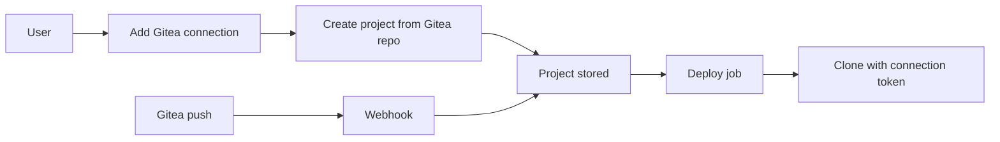

I do not expect this PR to be merged; I'm creating it to get some feedback and start a discussion. The reason I had to implement this feature is that my org uses Gitea for version control, so having native Gitea support (instead of a Gitea → GitHub mirror) was important.

I had to make a few design decisions while implementing it, with an eye toward things like GitLab or Forgejo integration in the future. So here it goes.

**Design decisions**

I treat the Git provider as a first-class concept on both Project and Deployment: each has `repo_provider` (e.g. github, gitea) and `repo_base_url`. The deploy worker branches on provider to decide how to clone (which token and which base URL). That way adding another provider later is a matter of one more branch in the worker and the same patterns I used for Gitea.

For Gitea I went with per-user connections: a `GiteaConnection` model where each user can add one or more instances (base URL + PAT, stored encrypted). That’s different from GitHub, which is app-level via installations, but it fits Gitea’s self-hosted nature and keeps the door open for other forges that work with user-level tokens.

Repo picker and webhooks are separate per provider (e.g. `/api/gitea/repo-select`, `/api/gitea/webhook`), but both paths end up creating the same kind of Project and Deployment and reuse the same deploy pipeline. Preset detection is already provider-agnostic: the code passes in whichever service (GitHub or Gitea) can fetch the repo tree, so a future provider would only need to implement that same interface.

**What changed**

Users can connect a Gitea instance (or Gitea.com) with a Personal Access Token in settings, then create projects from Gitea repos. Push webhooks from Gitea hit the webhook endpoint and trigger deployments the same way GitHub does. I added a `GiteaConnection` model, a small Gitea API client under `app/services/gitea.py`, and a router in `app/routers/gitea.py` for the repo picker and webhook. Projects and deployments now store `repo_provider`, `repo_base_url`, and for Gitea an optional `gitea_connection_id`; the migration backfills existing rows to GitHub.

I also made GitHub optional. If the GitHub App env isn’t set, the app still runs: login and the new-project flow only show the providers that are configured. `settings.has_github` and `settings.has_gitea` drive what appears in the UI, and the install/lib scripts no longer assume GitHub is present. I updated the env examples and install script so Gitea-related vars like `GITEA_WEBHOOK_SECRET` are documented and wired in when you use Gitea.

**How the Gitea flow fits together**

A user adds a Gitea connection in settings (base URL + token), which gets stored as a `GiteaConnection`. When they create a project they choose GitHub or Gitea; for Gitea they pick a connection and then a repo from that instance, and the project is saved with `repo_provider=gitea` and the connection id. When a push happens, Gitea sends a webhook to `/api/gitea/webhook`; the app finds projects matching that repo (by repo id and base URL), creates a deployment and enqueues the job. In the deploy job the code branches on `repo_provider`: for Gitea it clones using the connection’s token and `repo_base_url`, and for GitHub it uses the installation token and github.com.

